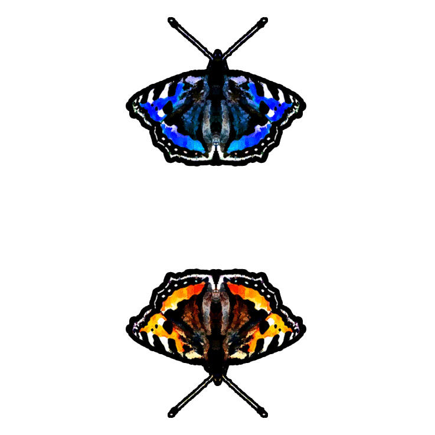

# Butterfly Helix 🦋

A mesmerizing 3D animation project featuring a rotating helix of color-shifted butterfly images. This was created while I was learning JavaScript and experimenting with CSS 3D transforms and animations.

## What It Does

This project creates a stunning visual effect where:
- 24 butterfly images are arranged in a 3D helix pattern
- Each butterfly is colored differently using CSS hue-rotation filters
- The entire helix rotates continuously
- The butterflies animate along the Z-axis, creating a "tunnel" effect

## Technologies Used

- **HTML5** - Basic page structure
- **CSS3** - 3D transforms, animations, and visual effects
- **JavaScript/jQuery** - Dynamic element generation and positioning

## How It Works

The JavaScript code dynamically:
1. Generates 24 figure elements
2. Applies different hue rotations to each butterfly image (creating a rainbow effect)
3. Positions each butterfly at 30-degree intervals around the helix
4. Uses `translateZ` to space them along the depth axis

The CSS handles:
- 3D perspective and transform-style properties
- Continuous rotation animation (20s per full rotation)
- Forward/backward Z-axis animation (10s cycle)
- Responsive viewport-based sizing

## Running the Project

Simply open `index.html` in a modern web browser. No build process or server required!

## Learning Experience

This project was created when I was only learning JavaScript, so you'll notice:
- Heavy use of jQuery for DOM manipulation
- Inline styling via JavaScript
- Creative experimentation with CSS 3D transforms and animations

It was a great way to learn about:
- CSS 3D transforms (`perspective`, `transform-style`, `translateZ`, `rotateZ`, `rotateY`)
- CSS animations and keyframes
- Dynamic DOM manipulation
- Working with filters and visual effects

## License

[MIT License](LICENSE)

---

*A fun experimental project exploring 3D CSS animations and JavaScript!*
